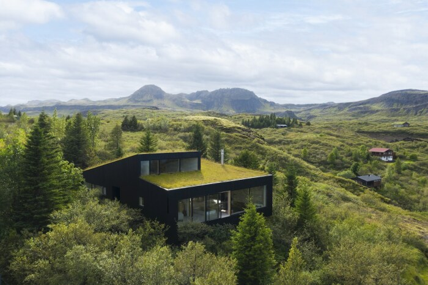
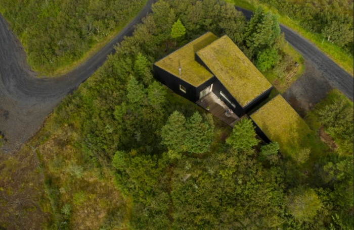
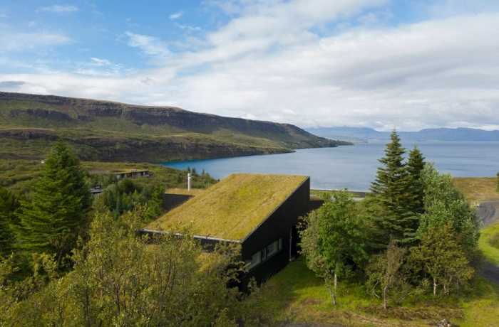
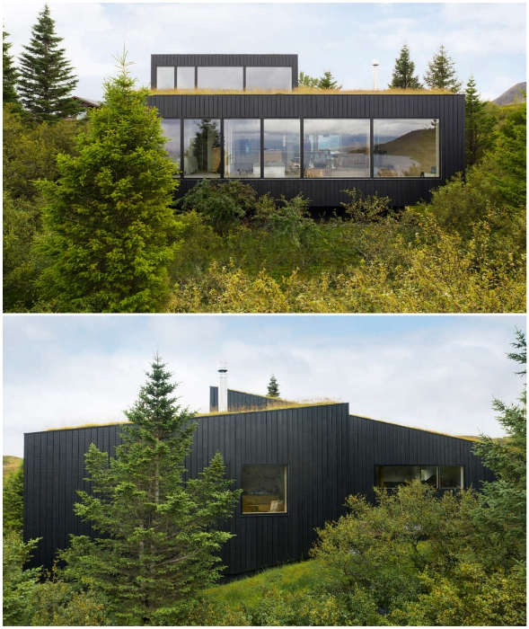
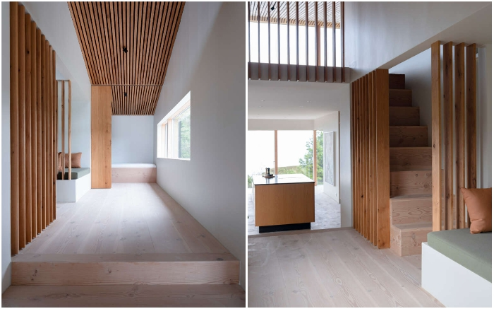

# Icelandic grass-roofed house captivated by the harmonious fusion of landscape and modern comfort

Increasingly, architects are developing projects that blend perfectly with the natural landscape and at the same time provide a comfortable refuge for those who want to take a break from the frenetic pace of city life. The architects from Reykjavik, for example, have integrated a house into a densely overgrown hill in the southwest of Iceland. Now the camouflaged country house pleases its prominent owners with complete fusion with nature, absolute quietness, special coziness and comfort. 

## And what else do you need for a busy man of today during the holidays?

In order to ensure that the building blends harmoniously into the natural landscape, the architects decided to make green roofs for each of the three volumes, located cascade. To add a modern aesthetic, part of the walls that rise above the hill were clad with black wood facade panels.

Although it took more than a selection of natural materials and textures to really make the house part of the hilly landscape. The location of the country residence was carefully considered after experts from various disciplines had extensively studied the terrain.

To the north, for example, the house is elevated above the bush to provide unobstructed views of the blue lake and Skjaldbreið Mountain from the living room.

On the southwest side, on the other hand, the living room has access to a glazed terrace, which, although densely surrounded by trees, offers an enchanting view of the Jórutindur and Hátindur mountains, with nothing to admire and of the lake. 

Preserving the pristine landscape and minimizing the impact on the soil structure was a priority both in the design process and during the construction of the house. Therefore, the house was assembled from modular blocks that were delivered to the site already in finished form.

"Entering a dialogue with the landscape, the concrete foundation of the wooden house lies in three stepped planes, which repeat the shape of the hill," commented the KRADS specialists on their constructive solution. "In the same way, the roof surface, overgrown with herbs and moss, partially replicates the slopes of the natural elevation."

